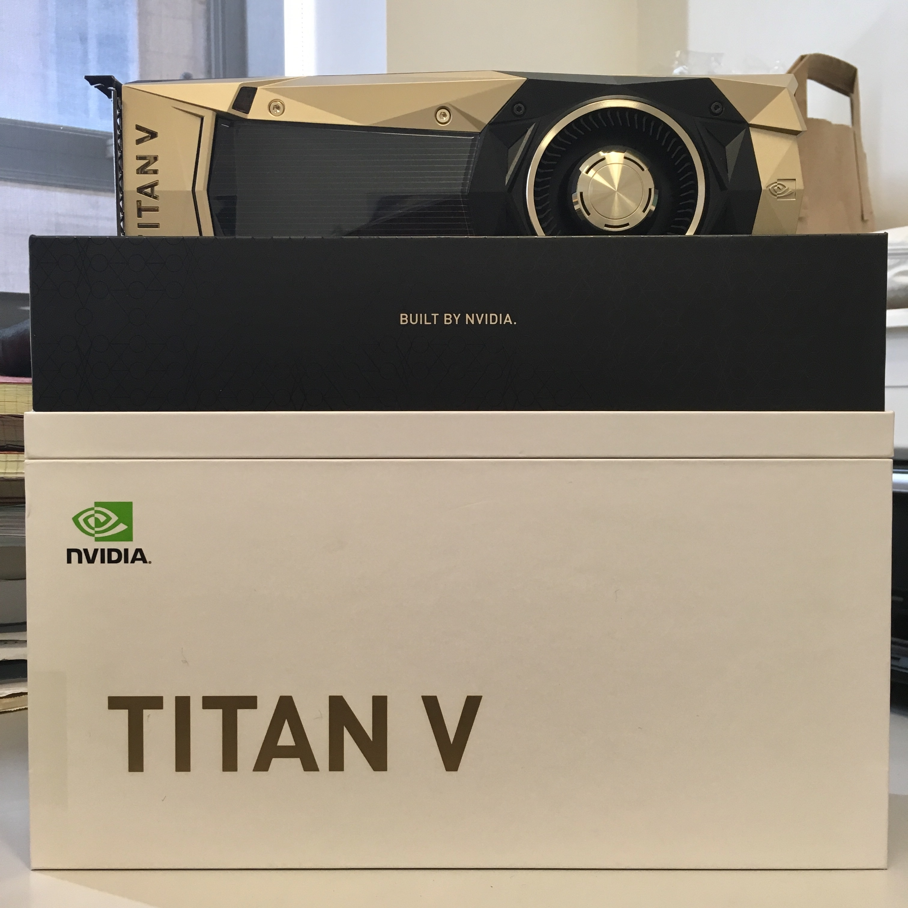

# psc-hpc-hybrid-challenge-2018

This is my winning submission for the Hybrid Challenge at [XSEDE HPC 2018 Summer Boot Camp](https://psc.edu/hpc-workshop-series/summer-bootcamp-2018), taught at [Pittsburgh Supercomputing Center](https://psc.edu/).

`laplace_mpi-grid_openacc_async_margin.c` is the submitted program, modified from example C program by [John Urbanic](https://www.psc.edu/staff/urbanic), who taught the course. It solves the Laplace equation with Jacobi iteration, as explained at https://devblogs.nvidia.com/openacc-example-part-1/.

`final-submission.job` is a Bash script with directives for the [Slurm](https://slurm.schedmd.com/) job scheduler. It is intended for four nodes, each with 2x NVIDIA P100 GPU.

Requires [OpenMPI](https://www.open-mpi.org/), and optionally [OpenACC](https://www.openacc.org/).

Update: Here's a picture of the prize:

